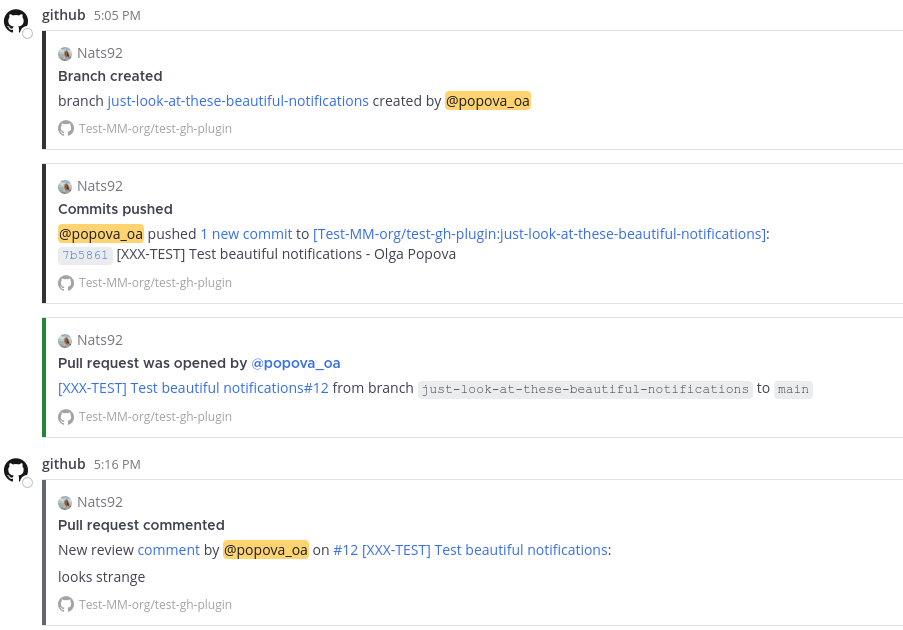

# Mattermost GitHub (Evrone) Plugin

This plugin is a fork of https://github.com/mattermost/mattermost-plugin-github with some improvements:

* attachments-like notifications appearance
* links to pull request comments
* information about branch names

## Features

You can configure plugin to receive notifications about:
* Branches: created, deleted
* Pull Requests: opened, closed, reopened, ready for review, merged, commented, approved, changes requested
* Issues: opened, closed, commented, labeled

Also, you can receive personal notifications about:
* Pull request review: commented, approved, changes requested, mentions

## Getting started

At first **remove** pre-packaged github plugin to avoid plugin conflicts.

### Upload plugin
Go to [releases](https://github.com/evrone-erp/mattermost-plugin-github/releases) and download plugin file from release assets (it looks like github-1.0.0.tar.gz).
Then upload this file to Mattermost. System Console / Plugin Management / Upload Plugin 

### Create OAuth App in your Github organization
* Go to https://github.com/organizations/[YOUR_ORGANIZATION]/settings/applications/new
* Enter Application name. For example, Mattermost GitHub Plugin
* Homepage URL: https://github.com/evrone-erp/mattermost-plugin-github
* Authorization callback URL: `[YOUR_MATTERMOST_URL]/plugins/github_evrone/oauth/complete`
* Press `Register App`
* After that, you will see App page with `Client ID` and button `Generate a new client secret`. Generate and save secret, also save `Client ID`

### Configure plugin in Mattermost console
* Go to System Console / Plugins / GitHub (Evrone)
* Set `Enable plugin`, `Display Notification Counters in Left Sidebar` and `Enable Private Repositories` to `true`.
* Fill `GitHub OAuth Client ID` with `Client ID` and `GitHub OAuth Client Secret` with `Client secret` from your Github OAuth App
* Regenerate `Webhook Secret` and `At Rest Encryption Key`
* Fill `GitHub Organizations` with your organization name. This field is optional, but if you left it empty, github counters at left panel of mattermost will not work
* Don't forget to click `save` button

### Create webhook in your Github organization
You can create webhook in your Github organization or in organization repository.

If you want to receive all notifications from all of you organization repositories in single mattermost channel, when better create organization webhook.
But if you have mattermost channels for each repository, better to make webhooks in repositories, to simplify subscriptions
* Go to `https://github.com/[YOUR_ORG_OR_REPO]/settings/hooks/new`
* Fill Payload URL with `[YOUR_MATTERMOST_URL]/plugins/github_evrone/webhook`
* Content type: application/json
* Secret: you can find it in mattermost System Console / Plugins / GitHub (Evrone) `Webhook Secret` field
* Select which events would you like to trigger
* Press `Add webhook`
* To make sure everything went well, go to /settings/hooks, find created hook and see `Last delivery was successful.`

### Add subscriptions to mattermost channels
* At first, connect you github with mattermost by command `/github connect private`
* Then you need to add channel subscriptions using command `/github subscriptions add [REPOSITORY_LINK] --features [features]`. 
`features` - Comma-delimited list of one or more of: `issues`, `pulls`, `pulls_merged`, `pulls_created`, `pushes`, `creates`, `deletes`, `issue_creations`, `issue_comments`, `pull_reviews`, `releases`, `workflow_success`, `workflow_failure`, `discussions`, `discussion_comments`, `label:"<labelname>"`. Defaults to `pulls,issues,creates,deletes`
* Have fun :)

### Personal settings
For greater convenience, you can set up personal notifications and reminders by executing commands

`/github settings notifications on` - notifications about your pull requests and mentions

`/github settings reminders  on` - full list of Unread Messages, Review Requests, Your Open Pull Requests and Your Assignments once a day   

More details about configuring, enabling, and using this Mattermost integration [Mattermost Product Documentation](https://docs.mattermost.com/integrate/github-interoperability.html)

### Examples

## Development

This plugin contains both a server and web app portion. Read documentation about the [Developer Workflow](https://developers.mattermost.com/integrate/plugins/developer-workflow/) and [Developer Setup](https://developers.mattermost.com/integrate/plugins/developer-setup/) for more information about developing and extending plugins.

