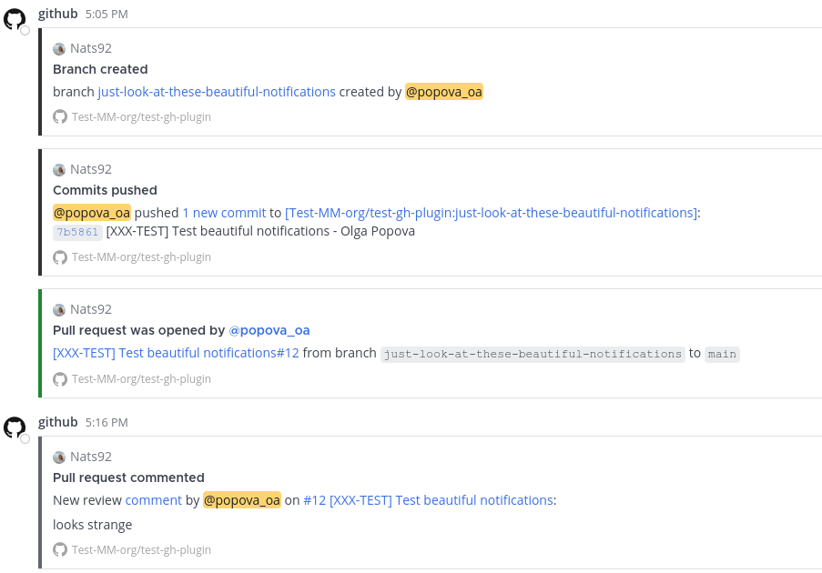

# Mattermost GitHub Plugin

This plugin is a fork of https://github.com/mattermost/mattermost-plugin-github with some improvements:

* attachments-like notifications appearance
* links to pull request comments
* information about branch names

Examples

## Basic

This plugin provides you with the ability to receive beautiful notifications about github actions in Mattermost

To use this plugin, go to [releases](https://github.com/evrone-erp/mattermost-plugin-github/releases) and download
plugin file from release assets (it looks like github-1.0.0.tar.gz).

Then upload this file to Mattermost. System Console -> Plugin Management -> Upload Plugin 

Further see the [Mattermost Product Documentation](https://docs.mattermost.com/integrate/github-interoperability.html) 
for details on configuring, enabling, and using this Mattermost integration.

## Development

This plugin contains both a server and web app portion. Read documentation about the [Developer Workflow](https://developers.mattermost.com/integrate/plugins/developer-workflow/) and [Developer Setup](https://developers.mattermost.com/integrate/plugins/developer-setup/) for more information about developing and extending plugins.

